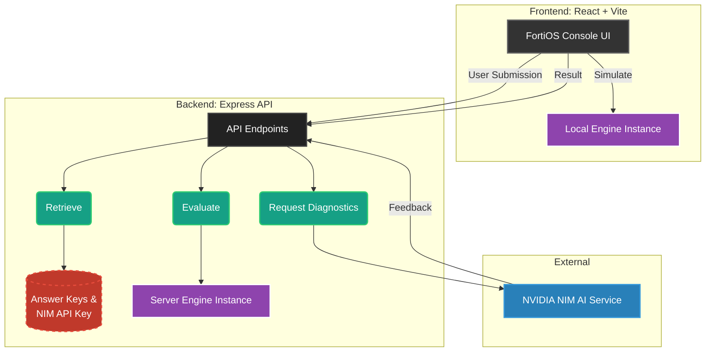
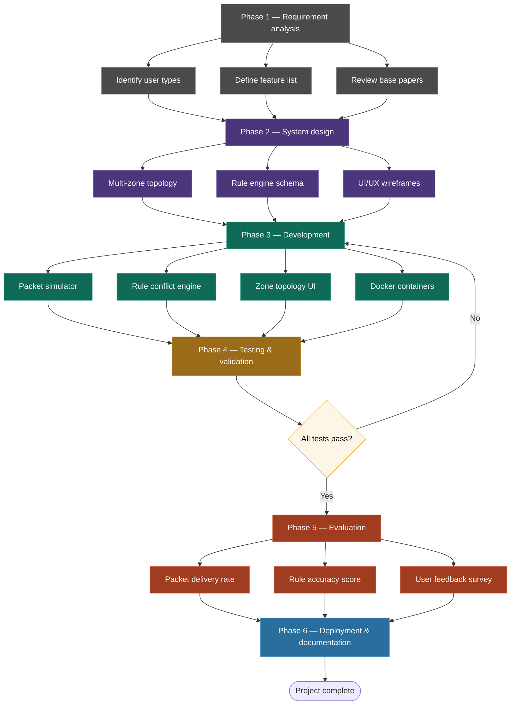

# FortiSim — FortiGate Configuration Training Simulator

An interactive web-based training platform where students learn firewall and
network configuration by working in a FortiOS-styled interface, get graded
on the *behavior* and *correctness* of their configuration (not exact text
matching), and receive Socratic, non-answer-revealing hints from an AI tutor
(NVIDIA NIM) when they get something wrong.

Built for classroom use alongside a real FortiGate 6000F lab unit, so the
visual language and workflow are intentionally modeled on the real FortiOS
web admin console.

## What students practice

### Firewall Policy (5 scenarios) to learn
Students configure firewall policies — source/destination addresses,
services, actions, logging — and the engine runs a battery of simulated
test packets against their configuration to verify the resulting traffic
behavior matches what the exercise requires.

1. **Web Server Access** — interface direction, service matching, default-deny
2. **Database Server Lockdown** — rule-order sensitivity (first-match-wins)
3. **DMZ Multi-Service** — configuring multiple required services correctly
4. **Inter-Zone Trust** — asymmetric zone rules (one direction allowed, not the reverse)
5. **Full Network Policy** — composing a complete multi-zone policy set

### Network Interfaces (3 scenarios)
Students configure interface IP addresses, subnets, and administrative
access settings for the WAN/LAN/DMZ zones.

1. **Interface IP Assignment** — assigning correct IPs and subnets
2. **Administrative Access Control** — restricting management protocols per zone
3. **Full Interface Setup** — complete interface configuration from scratch

### Port Assignment (5 scenarios)
Students assign physical chassis ports to logical zones using a visual
FortiGate-style chassis diagram.

1. **Basic Port Assignment**
2. **Multi-Server DMZ**
3. **Redundant WAN Uplinks**
4. **Larger Office Network**
5. **Don't Assume by Position**

All exercises are accessible at any time — there is no locked progression.
Every submission is graded immediately, and on a failed submission an AI
tutor (via NVIDIA NIM) gives conceptual, non-prescriptive feedback: it
explains *why* something is wrong without ever stating the correct value.


## Objectives
1. Simulate real-world firewall rule creation, ordering, and conflict resolution in a safe, sandboxed environment.
2. Enable learners to configure inbound and outbound traffic policies using IP, port, and protocol-based rules.
3. Visualise packet flow through firewall rule chains, showing which rule matched and why a packet was allowed or blocked.
4. Provide immediate feedback on misconfigurations by highlighting shadowed rules, overlapping policies, and rule-order errors.
5. Support multi-zone network topologies such as DMZ, LAN, and WAN so learners can practice enterprise-style segmentation concepts.
6. Offer scenario-based challenges such as blocking all Telnet traffic or allowing only HTTPS to a web server, with automated grading.
7. Run fully in Docker so no physical firewall hardware or cloud instance is required.

## Problem statement, solution, and novelty

### Problem 1: Limited access to firewall learning infrastructure
**Issue:** Learning firewall configuration often requires expensive hardware such as Cisco ASA or FortiGate devices, or paid cloud virtual machines, which are inaccessible to many students.

**How FORT-SIM overcomes it:** FORT-SIM runs entirely through Docker. A single `docker-compose up` command can launch a full simulated network environment at near-zero infrastructure cost.

**What is new:** A TypeScript-based rule engine reproduces stateful packet inspection logic without depending on a kernel-level firewall module.

### Problem 2: Existing simulators are hard to install and not web-friendly
**Issue:** Tools such as Packet Tracer and GNS3 often involve heavier setup and are not ideal for quick, browser-based learning sessions.

**How FORT-SIM overcomes it:** The system uses a monorepo architecture with shared `packages/` modules and a web UI, allowing learners to access the simulator through a local browser session without separate client installation.

**What is new:** Shared TypeScript packages allow the same rule engine to be reused consistently across the UI, API, and test layers.

### Problem 3: Firewall tools often do not explain blocked traffic clearly
**Issue:** Learners frequently see packets blocked without understanding which rule matched, why the rule matched, or how ordering affected the result.

**How FORT-SIM overcomes it:** The simulator traces each packet against the rule chain and displays the first matching rule, the action taken, and the reason in the interface.

**What is new:** A step-by-step trace with diff-style highlighting shows which rules were skipped and which rule fired, making firewall decisions easier to debug.

### Problem 4: Rule shadowing is difficult for beginners to detect
**Issue:** A later rule may never be reached because an earlier rule already matches all relevant traffic, creating shadowed or redundant policies.

**How FORT-SIM overcomes it:** The engine performs ruleset analysis whenever rules are edited and flags shadowed or redundant entries before packet simulation even begins.

**What is new:** This behaves like a linter for firewall policies, providing proactive anomaly detection instead of reactive troubleshooting.

### Problem 5: Multi-zone segmentation is usually taught only in theory
**Issue:** Security courses often describe LAN, DMZ, and WAN segmentation conceptually, but learners rarely get practical experience configuring inter-zone policies.

**How FORT-SIM overcomes it:** Docker Compose defines multiple virtual zones and hosts, enabling users to build policies across segmented networks and test zone-to-zone communication safely.

**What is new:** A visual topology canvas shows zone-to-zone traffic status in real time with colour-coded results that change as rules are updated.


## Project structure




-----



## Additional naming ideas

### Fort / wall wordplay
- RuleFort
- WallCraft
- BastionLab
- Sentrynet

### Packet / traffic themed
- PacketForge
- FlowGate
- TrafficSentinel
- GateKeeperX

### Learning / sandbox themed
- FireDrill
- RuleRange
- CyberMoat
- PolicyForge

### Short, brandable, acronym-style
- ZoneIQ
- RuleLens
- NetSentry Sim
- FireMesh

### Distinct / abstract
- Ironclad Lab
- Perimetr
- RuleForge Academy
- ChokePoint

---
## Running locally

Requires Docker and Docker Compose.

```bash
cp packages/backend/.env.example packages/backend/.env
# edit packages/backend/.env and set a real NVIDIA_NIM_API_KEY

docker compose up
```


Frontend: http://localhost:5173
Backend health check: http://localhost:4000/api/health

The frontend dev server proxies `/api` requests to the backend container
over the Docker Compose network (`http://backend:4000`), not `localhost`,
since the proxy config runs inside the frontend container.

## Why answer keys and API keys never reach the browser

This is a structural guarantee, not just a convention:

- `getStudentFacingScenario()` in the backend strips `expectedOutcomes`
  (the answer key) before any scenario is sent to the frontend.
- The AI feedback service only ever receives a `GradingReport` —
  diagnostic facts about what the *student's own* configuration did —
  never the scenario's correct values. The AI cannot leak what it was
  never given.
- The NVIDIA NIM API key lives only in the backend's `.env` file and is
  never included in any response sent to the client.

See `docs/ARCHITECTURE.md` for the full request flow diagram.

## Design principles this project follows

- **Minimal, focused scope.** This is a teaching tool for firewall and
  network fundamentals — not an attempt to replicate every FortiOS
  feature. Sections not yet built (Security Profiles, VPN, SD-WAN, etc.)
  are deliberately left out rather than added as broken placeholders.
- **Behavioral grading over exact-match grading.** Firewall policy
  scenarios are graded on the resulting traffic behavior (does the right
  traffic get accepted/denied), not on matching a specific configuration
  text — multiple valid configurations should all pass.
- **One evaluator, two consumers.** The same matching/grading logic
  backs both the student's instant local feedback and the backend's
  authoritative grade, so they can never disagree.
- **AI as a Socratic guide, never an answer key.** The AI tutor is
  structurally prevented from seeing correct values, not just prompted
  not to reveal them.

## Tech stack

- **Engine:** TypeScript, no runtime dependencies
- **Backend:** Node.js, Express
- **Frontend:** React, Vite, Tailwind CSS, React Router
- **AI:** NVIDIA NIM (Llama 3.1 70B Instruct)
- **Infrastructure:** Docker Compose, npm workspaces monorepo
